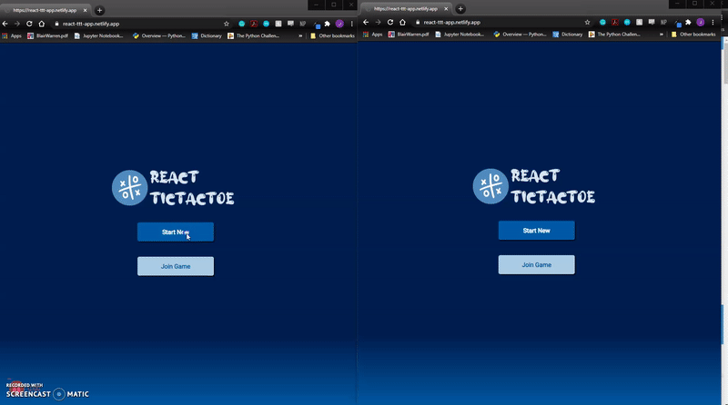

# react-tic-tac-toe
## Description 
A multiplayer tic tac toe game made using React on the front-end and a NodeJS server on the backend with SocketIO for realtime gameplay communication. This is the first app I wrote using React which takes inspiration from the [Intro to React](https://reactjs.org/tutorial/tutorial.html) tutorial from the react team, which features the building of a tic tac toe game. 



## Architecture
### The front-end
Built with create-react-app, the front-end requires 2 routes: the starting page and the game room. I won't comment much on the game room here. The starting page give the user a choice of whether to create a new room or enter an already existing room. This was built using a multi-step form flow as shown below

```tsx
//step is stored in global state
switch(this.state.step){
    //Initial step the user see
    case(1):
        return (
            //The component with 2 buttons to let the user choose whether to create or enter an existing room
            <Choice logo={logo} onChoice={this.onChoice}/>
        );
    case(2):
        //The second step where the user either input just their name to create a new room or their name and a room id to enter an existing room. The newGame prop decides which version of input form to display.
        return (
            <>
                <Loading loading={this.state.loading}/>
                <Error display={this.state.error} message={this.state.errorMessage}/>
                <InputForm 
                    stepBack={this.stepBack} 
                    onSubmit={this.onSubmit} 
                    onTyping={this.onTyping.bind(this)}
                    newGame={this.state.newGame}
                    name = {this.state.name}
                    room = {this.state.room}/> 
            </>
        );
    default:
        return null
}
```

There are 2 things I would do different than this set up for the starting page. One is the use of functional component instead of a class component. This is purely because of my preference in syntax rather than an increase in performance. Since I was following the react tutorial which was using class components, I ended up using the class component syntax here. The second thing I would do different, which also have to do with how I set up the socket.io server is to not use socket communication on this page. Instead a simple rest api should have done the trick here.  

### The server
The server was built using socket.io. The first thing to comment about the server.js file is the room logics on line 20-67, these should have been abstracted to a utilities class. The rooms is a mapping stored in memory so if the server went down then the games will be erased, perhaps redis would have been a good solution here with the in-memory database capabilities but also on-disk persistance capability. The bulk of the socket.io server is the following code block with individual events to handle requests from the client.

```js
io.on('connection', socket =>{
//On the client submit event (on start page) to create a new room
socket.on('newGame', () => {
    new Promise(makeRoom).then((room) => {
        socket.emit('newGameCreated', room)
    })
})

//On the client submit event (on start page) to join a room
socket.on('joining', ({room}) => {
    if (rooms.has(room)){
        socket.emit('joinConfirmed')
    }else{
        socket.emit('errorMessage', 'No room with that id found')
    }
})
...
}
```
To explain how the server works, a mapping with the room id as the key and the board state as the value is stored in memory. When the a player from make a move, the state of that board is updated and then broadcasted to all the player ids associated with that room. Overall, with my current skill level and aside from the fixes mentioned before, I think this server is fairly well written for the purpose of the game.
